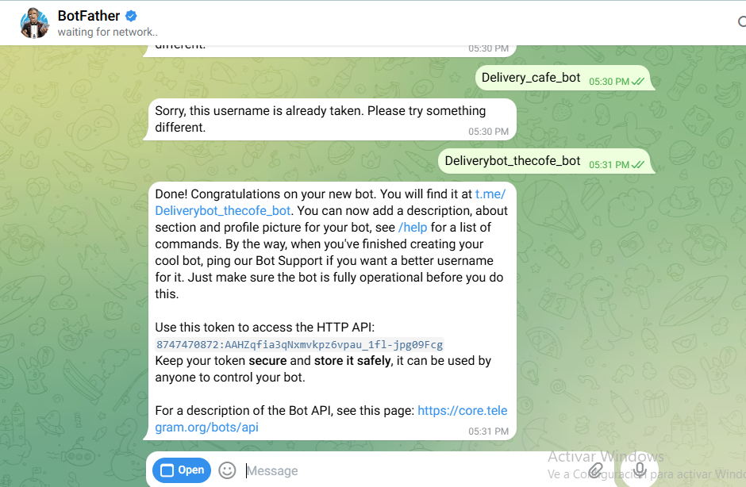

# 🤖 DeliveryBot – Gestión de Pedidos Internos de Cafetería

**Autor:** Kevin Andrés Castillo Pabón  
**Tecnologías:** n8n · Telegram · Google Sheets · Groq AI (LLaMA) · ngrok · Docker

---

## 📋 Descripción

DeliveryBot es un sistema de automatización de pedidos para cafeterías institucionales construido sobre **n8n**. Convierte a Telegram en una terminal de pedidos inteligente con un agente de IA que permite a los usuarios consultar el menú, gestionar su carrito y realizar pedidos en tiempo real.

---

## 🏗️ Arquitectura del Sistema

```
Usuario (Telegram) ──► Telegram Bot ──► n8n Workflow
                                              │
                              ┌───────────────┼───────────────┐
                              ▼               ▼               ▼
                        AI Agent         Google Sheets    Grupo Cocina
                     (Groq/LLaMA)       (Base de datos)   (Telegram)
```

---

## 🚀 Instalación y Configuración Paso a Paso

### Paso 1 – Crear el Bot de Telegram con BotFather

El primer paso es registrar el bot en Telegram. Se utiliza **@BotFather** para obtener el token HTTP que permite conectar n8n con Telegram.



> ⚠️ El token generado (ej: `8747470872:AAHZqfia3qNxmvkpz6vpau_1fl-jpg09Fcg`) es la clave de acceso al bot. Guárdalo de forma segura.

---

### Paso 2 – Crear el proyecto en Google Cloud y habilitar APIs

Se crea un proyecto llamado `deliverybot` en Google Cloud Console y se habilitan los servicios necesarios: **Google Sheets API** y **Google Drive API**.


> Ambos servicios son necesarios para que n8n pueda leer y escribir datos en las hojas de cálculo.

---

### Paso 3 – Obtener la Gemini API Key (Google AI Studio)

Para usar inteligencia artificial, se crea una **API Key de Gemini** en Google AI Studio bajo el proyecto `deliverybot`.


> Esta clave se configura en n8n como credencial del nodo **Google Gemini Chat Model**.

---

### Paso 4 – Configurar la base de datos en Google Sheets

Se crea el archivo `deliverybot` en Google Sheets con 4 hojas: **menu**, **pedidos**, **usuarios** y **sessions**. La hoja `menu` se pobló con 16 productos iniciales.


| Columnas | Descripción |
|---|---|
| `id_producto` | Identificador único del producto |
| `nombre` | Nombre del producto |
| `descripcion` | Descripción corta |
| `precio` | Precio en pesos colombianos |
| `categoria` | Bebidas / Comidas / Snacks |
| `stock` | Unidades disponibles |

---

### Paso 5 – Primer workflow: Telegram Trigger + Leer Menú

Se construye el flujo inicial en n8n: un **Telegram Trigger** que recibe mensajes y un nodo **Get row(s) in sheet** que lee la hoja `menu`.


> La prueba retorna los 6 productos que había en ese momento, confirmando la conexión con Google Sheets.

---

### Paso 6 – Flujo base funcional (Trigger → Sheets)

Vista general del workflow con los dos primeros nodos conectados y ejecutándose correctamente.


---

### Paso 7 – Integrar el AI Agent con Google Gemini

Se añade el **AI Agent** al flujo con **Google Gemini Chat Model** como motor de lenguaje. Este agente interpreta los mensajes del usuario y decide qué acciones ejecutar.


---

### Paso 8 – Flujo completo con herramientas del agente

El AI Agent se conecta a las herramientas de Google Sheets: **leer_menu** y **ver_carrito**, permitiendo consultas dinámicas del menú y del carrito del usuario.


---

### Paso 9 – Error con Simple Memory y solución

Al intentar añadir **Simple Memory** al agente para recordar el contexto de conversación, se presentó un error de configuración. Esto llevó a revisar los parámetros del nodo.


---

### Paso 10 – Error en nodo guardar_en_carrito (columnas desactualizadas)

El nodo `guardar_en_carrito` presentó un problema: los nombres de columnas de la hoja `sessions` habían sido actualizados después de configurar el nodo, causando un conflicto.


> **Solución:** Hacer clic en "Refresh columns list" en el parámetro **Column to Match On** del nodo para sincronizar los nombres de columna.

---

### Paso 11 – Flujo completo versión 3 (con condicional para cocina)

Versión avanzada del workflow que incluye un nodo **If** para enrutar notificaciones al grupo de cocina cuando se confirma un pedido. Se publica como `version3_prueba`.


---

### Paso 12 – Publicación version3_prueba

Se documenta y publica la versión 3 con el condicional de cocina implementado.


---

### Paso 13 – Error en hoja pedidos: fórmulas corruptas

Al guardar un pedido, la hoja `pedidos` mostraba errores `#NAME?` y `#ERROR!` porque n8n intentó escribir texto con formato de fórmula (ej: `=ORDEN-4721`).


---

### Paso 14 – Causa del error: texto interpretado como fórmula

Al inspeccionar la celda A2, se confirma que el valor `=ORDEN-4721` fue interpretado como fórmula por Google Sheets, generando el error **"Nombre de intervalo desconocido: 'ORDEN'"**.


> **Solución:** En el prompt del agente y en el nodo de guardado, asegurarse de que el `id_pedido` se envíe como texto plano (ej: `"ORDEN-4721"`) y no como expresión matemática.

---

### Paso 15 – Bot funcionando: memoria del carrito entre sesiones

El bot recuerda el carrito del usuario entre conversaciones gracias a la hoja `sessions`. Al iniciar una nueva sesión, el bot informa que hay una Hamburguesa Clásica pendiente en el carrito.


---

### Paso 16 – Cambio de modelo a Groq (sin límites estrictos de tokens)

Se migra el modelo de IA de Gemini a **Groq (LLaMA)** para evitar las restricciones de tokens en el plan gratuito. Se publica como `version_groc_prueba`.


---

### Paso 17 – Error de formato Markdown en Telegram

Al enviar la respuesta del agente directamente a Telegram, se produce un error: **"Character '!' is reserved and must be escaped with the preceding '\'"**. Esto ocurre porque el agente usa caracteres especiales de MarkdownV2 sin escapar.


> **Solución:** En el nodo "Send a text message", cambiar el campo **Parse Mode** a `None` (texto plano) o ajustar el prompt para que el agente no use Markdown.

---

### Paso 18 – Segundo workflow: Reporte Diario (Schedule Trigger)

Se crea un segundo workflow independiente llamado **DeliveryBot - Reporte Diario** que se ejecuta automáticamente con un **Schedule Trigger** para generar reportes de ventas desde Google Sheets.


---

### Paso 19 – Error en detalles_pedido: texto guardado como fórmula

La columna `detalles_pedido` mostraba `#ERROR!` porque el contenido (ej: `empanada y Perro Caliente y Jugo`) estaba siendo interpretado como fórmula de suma por Google Sheets.


> **Solución:** Envolver el valor con un apóstrofo al inicio (`'empanada y Perro...`) o configurar el nodo de escritura para que trate el campo como texto plano (`value_input_option: RAW`).

---

### Paso 20 – Bot en producción: flujo completo de pedido

El bot funciona correctamente de extremo a extremo. El usuario pide un Perro Caliente, el bot lo agrega al carrito, y al escribir "pedir" confirma el pedido con el total calculado.


---

## ⚙️ Módulos del Sistema

### 1. Interfaz de Usuario (Telegram)
- Menú digital por categorías: Bebidas, Comidas, Snacks
- Carrito de compras conversacional
- Historial y seguimiento de pedidos en tiempo real

### 2. Motor de Procesamiento (n8n + AI Agent)
- Agente de IA con modelo LLaMA via Groq
- Herramientas: `leer_menu`, `guardar_en_carrito`, `ver_carrito`, `guardar_pedido`, `actualizar_stock`, `actualizar_estado`, `ver_pedidos`, `registrar_usuario`
- Memoria de conversación con Simple Memory
- Notificación automática al grupo de cocina

### 3. Base de Datos (Google Sheets)
- **MENU:** Catálogo de productos con stock
- **PEDIDOS:** Registro de órdenes con estados
- **USUARIOS:** Registro de clientes
- **SESSIONS:** Carritos temporales

---

## 🗄️ Modelo de Datos

### MENU
| id_producto | nombre | descripcion | precio | categoria | stock |

### PEDIDOS
| id_pedido | telegram_id | detalles_pedido | total_pago | estado | fecha | hora |

### USUARIOS
| telegram_id | nombre_completo | departamento | puntos_lealtad |

### SESSIONS
| telegram_id | pantalla_actual | carrito_temporal | ultimo_cambio |

---

## 💬 Comandos del Bot

| Comando | Función |
|---|---|
| `/start` | Iniciar el bot y ver categorías |
| `ver menú` | Ver productos disponibles |
| `agregar X` | Agregar producto al carrito |
| `/carrito` | Ver carrito actual con total |
| `pedir` | Confirmar y realizar el pedido |
| `/historial` | Ver últimos pedidos |
| `/estado` | Ver estado del pedido activo |

---

## 📊 Flujo del Pedido

```
Usuario escribe  ──►  Telegram Bot  ──►  Code JS (parsea contexto)
                                               │
                                               ▼
                                          AI Agent (Groq)
                                               │
                              ┌────────────────┼────────────────┐
                              ▼                ▼                ▼
                        leer_menu      guardar_en_carrito   ver_carrito
                              │                │
                              └────────────────┘
                                               │
                                          guardar_pedido
                                               │
                              ┌────────────────┼────────────────┐
                              ▼                ▼                ▼
                       actualizar_stock   Send mensaje     Send cocina
                                          al usuario       (grupo TG)
```

---

## ⚠️ Errores Conocidos y Soluciones

| Error | Causa | Solución |
|---|---|---|
| `#NAME?` en id_pedido | n8n envía `=ORDEN-XXXX` como fórmula | Enviar como texto plano sin `=` |
| `#ERROR!` en detalles_pedido | El operador `y` interpretado como suma | Usar `value_input_option: RAW` |
| `Character '!' must be escaped` | Markdown V2 en Telegram | Cambiar Parse Mode a `None` |
| `Column names updated after setup` | Columnas renombradas post-configuración | Refrescar lista de columnas en el nodo |
| `Error in sub-node Simple Memory` | Configuración incorrecta de sesión | Revisar parámetro Session Key |

---

## 🛠️ Requisitos

- Docker Desktop
- ngrok con dominio personalizado
- Cuenta de Google (Sheets + AI Studio)
- Cuenta de Telegram
- Cuenta de Groq (gratuita)
- n8n (self-hosted via Docker)

## 🔗 Enlaces

- 📊 [Google Sheets - DeliveryBot_DB](https://docs.google.com/spreadsheets/d/1Aw7EBQFR6jhHoPiIE32bPgvJeXnQsELQPvH3jEU6K58/edit?usp=sharing)
- 🤖 Bot de Telegram: @Deliverybot_thecofe_bot
- 📁 [Repositorio GitHub](TU_LINK_DEL_REPO)
